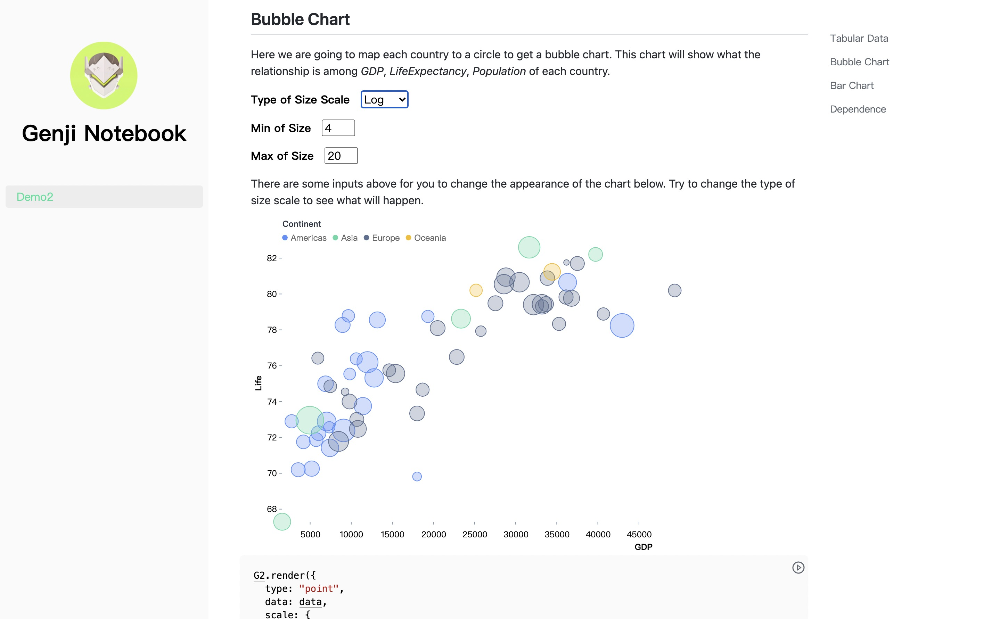
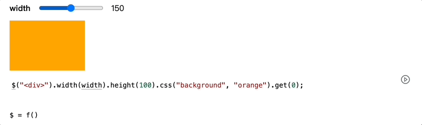

# Genji

> Author observable and interactive document as simple as markdown.

**Genji** is a concise grammar that extends markdown to author observable and interactive JavaScript document. It is inspired by [Observable](https://observablehq.com/explore) and is useful to write documentation for web-based library.



This repo will not only introduce the _specification_ of Genji, it also will provide several following tools to build observable and interactive document.

- [Genji Notebook](./packages/genji-notebook/) - A doc tool based on Genji to build observable and interactive website.
- [Genji Renderer](./packages/genji-renderer/) - A JavaScript library to render Genji. (WIP)
- [Genji Rect](./packages/genji-react/) - A Rect component to render Genji. (WIP)
- [Genji Vue](./packages/genji-vue/) - A Vue component to render Genji. (WIP)
- [Genji Dumi](./packages/genji-dumi/) - A plugin to render Genji in [Dumi](https://github.com/umijs/dumi). (WIP)

## Links

- [Showcase](http://g2-next.antv.vision/overview/)
- [Demo](https://pearmini.github.io/genji-demo/)

## Get Started

Let's get started with a simple but solid example.

````markdown
```js | range "pin: false; min: 100; max: 200"
width = 150;
```

```js
$("<div></div>").width(width).height(100).css("background", "orange").get(0);
```

```js | dom "pin: false"
$ = genji.require("jquery");
```
````

The markdown above will be rendered as follows in Genji environment.



This example dose three things:

- Require [Jquery](https://jquery.com/) by the function `genji.require` from **builtin library** asynchronously.
- Declare a **reactive variable** `width` and mark it as a range output using markup _range_.
- Using required Jquery and `width` variable to render a **responsive orange div element**.

Let's explain how Genji manage to do these.

Each JavaScript codeblock in Genji is **executable** and **editable** by default. And it suppose to have only one _statement_ or _expression_ in each codeblock. The return value of the codeblock will be displayed in the document as output with different form.

It it is a _HTMLElement_ or _SVGElement_, the element will be mounted directly, such as:

```js
$("<div></div>").width(width).height(100).css("background", "orange").get(0);
```

If it is non-element value, the _description_ of the value will be displayed by default, such as:

```js
$ = genji.require("jquery");
```

It is also possible to change the default display of non-element value by **markup**, such as:

```js | range "pin: false; min: 100; max: 200"
width = 150;
```

The return value is number by default, but with markup `range`, it will be rendered as range input with specified options `pin: false; min: 100; max: 200`. Besides inputs markup, there are also other kind of markup types such as _table_, which will render an array of object into a table.

Each codeblock is not independent and can reference each other. **It can be synchronous or asynchronous, and once its value has changed, the output of codeblocks reference it will rerender.** This is why every time the input value of the range input changed, the orange div element will change simultaneously.

There is no need for you to consider the order of codeblocks in the document, Genji is smart enough to execute the codeblocks in right order.

## Specification

- [Codeblock](#Codeblock) - The supported codeblock syntax.
- [Markup](#Markup) - Markup to decorate the return value of codeblock.
- [Stdlib](#Stdlib) - Some builtin functions to help write codeblock.

### Codeblock

<a name="declare_a_variable" href="#declare_a_variable">#</a> **Declare a variable.**

The following ways of declaring a variable have no difference, but the first one is recommended, because it make more sense as each variable is changeable.

````markdown
```js
a = 1;
```

```js
let a = 1;
```

```js
var a = 1;
```

```js
const a = 1;
```
````

<a name="declare_a_function" href="#declare_a_function">#</a> **Declare a function.**

````markdown
```js
// Declare a synchronous function.
function add(x, y) {
  return x + y;
}
```

```js
// Declare a asynchronous function.
async function delay(ms) {
  await new Promise((resolve) => setTimeout(ms, resolve));
}
```
````

<a name="call_a_function" href="#call_a_function">#</a> **Call a function**

````markdown
```js
// Call a defined function
add(1, 1);
```

```js
// Call a synchronous IIFE(immediately-invoked function expression)
// This is useful for complex codeblock.
(() => {
  const div = document.createElement("div");
  div.innerText = "Hello World";
  div.style.background = "red";
  return div;
})();
```

```js
// Call a asynchronous IIFE.
(async () => {
  const text = await new Promise((resolve) =>
    setTimeout(() => resolve("hello"), 3000)
  );
  const div = document.createElement("div");
  div.innerText = "hello";
  div.style.background = "red";
  return div;
})();
```
````

<a name="execute_an_expression" href="#execute_an_expression">#</a> **Execute an expression**

```js
height = width * 2;
```

### Markup

Markup is specified as `js | [markup] "[options]"`, and the syntax of options is like `"key1: value1; key2: value2;..."`. **The options can be only specified in double quote and all is optional**.

<a name="markup_pure" href="#markup_pure">#</a> **pure**

JavaScript codeblock with _pure_ markup will not execute and acts like a normal text with highlight.

````markdown
```js | pure
(() => {
  const div = document.createElement("div");
  div.innerText = "hello world";
  div.style.background = "red";
  return div;
})();
```
````

<a name="markup_dom" href="#markup_dom">#</a> **dom**

The default markup for all executable codeblock is _dom_, it can be ignored if there is no options for this markup.

```ts
type Options = {
  /**
   * @description Hide the code by default with false value.
   * @default false
   */
  pin?: boolean;
};
```

````markdown
```js | dom
(() => {
  const div = document.createElement("div");
  div.innerText = "hello world";
  div.style.background = "red";
  return div;
})();
```
````

<a name="markup_text" href="#markup_text">#</a> **text**

Render `<input type='text'>`.

```ts
type Options = {
  /**
   * @description The label for the input.
   */
  label?: string;
  /**
   * @description Hide the code by default with false value.
   * @default false
   */
  pin?: boolean;
};
```

````markdown
```js | text
a = "hello world";
```
````

<a name="markup_number" href="#markup_number">#</a> **number**

Render `<input type='number'>`.

```ts
type Options = {
  /**
   * @description The label for the input.
   */
  label?: string;
  /**
   * @description The step of the input.
   * @default 1
   */
  step?: number;
  /**
   * @description The min value of the input.
   * @default -Infinity
   */
  min?: number;
  /**
   * @description The max value of the input.
   * @default infinity
   */
  max?: number;
  /**
   * @description Hide the code by default with false value.
   * @default false
   */
  pin?: boolean;
};
```

````markdown
```js | number "min:1; max: 20; step: 2"
a = 10;
```
````

<a name="markup_range" href="#markup_range">#</a> **range**

Render `<input type='range'>`.

```ts
type Options = {
  /**
   * @description The label for the input.
   */
  label?: string;
  /**
   * @description The step of the input.
   * @default 1
   */
  step?: number;
  /**
   * @description The min value of the input.
   * @default -Infinity
   */
  min?: number;
  /**
   * @description The max value of the input.
   * @default infinity
   */
  max?: number;
  /**
   * @description Hide the code by default with false value.
   * @default false
   */
  pin?: boolean;
};
```

````markdown
```js | range "min:1; max: 20; step: 2"
a = 10;
```
````

<a name="markup_color" href="#markup_color">#</a> **color**

Render `<input type='color'>`.

```ts
type Options = {
  /**
   * @description The label for the input.
   */
  label?: string;
  /**
   * @description Hide the code by default with false value.
   * @default false
   */
  pin?: boolean;
};
```

````markdown
```js | color
a = "red";
```
````

<a name="markup_select" href="#markup_select">#</a> **select**

Render a `<select>`.

```ts
type Options = {
  /**
   * @description The label for the input.
   */
  label: string;
  /**
   * @description The options for select.
   * @default []
   */
  options: { labels: string[]; values: (string | number)[] }[];
  /**
   * @description Hide the code by default with false value.
   * @default false
   */
  pin?: boolean;
};
```

````markdown
```js | select "options: { labels: ['A', 'B', 'C'], values: ['a', 'b', 'c'] }"
a = "a";
```
````

<a name="markup_radio" href="#markup_radio">#</a> **radio**

Render a `<radio>`.

```ts
type Options = {
  /**
   * @description The label for the input.
   */
  label: string;
  /**
   * @description The options for radio.
   * @default []
   */
  options: { labels: string[]; values: (string | number)[] }[];
  /**
   * @description Hide the code by default with false value.
   * @default false
   */
  pin?: boolean;
};
```

````markdown
```js | radio "options: { labels: ['A', 'B', 'C'], values: ['a', 'b', 'c'] }"
a = "a";
```
````

<a name="markup_table" href="#markup_table">#</a> **table**

Render an array of objects into a table.

```ts
type Options = {
  /**
   * @description The max count of rows.
   * @default 10
   */
  maxCount: number;
  /**
   * @description Hide the code by default with false value.
   * @default false
   */
  pin?: boolean;
};
```

````markdown
```js | table "maxCount: 5"
data = [
  { year: "1951 年", sale: 38 },
  { year: "1952 年", sale: 52 },
  { year: "1956 年", sale: 61 },
  { year: "1957 年", sale: 145 },
  { year: "1958 年", sale: 48 },
  { year: "1959 年", sale: 38 },
  { year: "1960 年", sale: 38 },
  { year: "1962 年", sale: 38 },
];
```
````

### Stdlib

All the stdlib can be called with namespace **genji** directly in the executable JavaScript codeblock.

<a name="stdlib_preview" href="#stdlib_preview">#</a> **preview**<i>(items, options)</i> · [Examples](https://pearmini.github.io/genji/test4#preview)

Render previews for specified items. Shape of each item is as followed.

```ts
type Item = {
  /**
   * @description The image for the thumbnail.
   */
  thumbnail: string;
  /**
   * @description The path to the codeblock for the thumbnail.
   * @note It must be absolute path from the `config.output` root.
   */
  path: string;
  /**
   * @description The title for the thumbnail.
   */
  title: string;
};

type Options = {
  /**
   * @description The height for each thumbnail.
   * @default 175
   */
  height: number;
  /**
   * @description The css background-size
   * @default cover
   */
  size: "contain" | "cover";
};
```

```js
genji.preview(
  [
    {
      thumbnail: "../assets/preview.png",
      path: "/test1/#test-advanced-usage",
      title: "Bar Chart",
    },
    {
      thumbnail: "../assets/preview.png",
      path: "/test1/#test-advanced-usage",
      title: "Bar Chart",
    },
  ],
  {
    height: 300,
    size: "contain",
  }
);
```

<a name="stdlib_fetchJSON" href="#stdlib_fetchJSON">#</a> **fetchJSON**<i>(url)</i>

Fetch file with JSON format and return a object.

```js
const data = await fetchJSON(
  "https://gw.alipayobjects.com/os/antvdemo/assets/data/bubble.json"
);
```

<a name="stdlib_require" href="#stdlib_require">#</a> **require**<i>(url)</i>

See [d3-require](https://github.com/d3/d3-require) for more details.

## License

MIT
