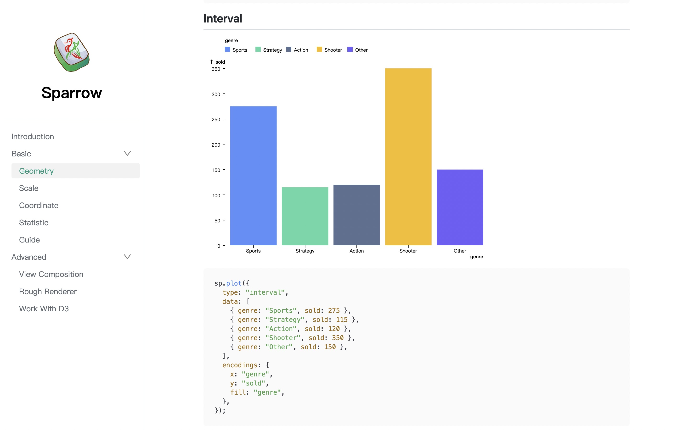
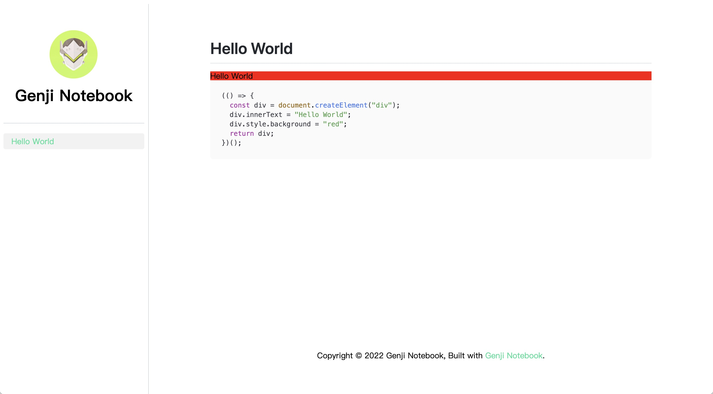

# Genji Notebook

Build observable and interactive JavaScript notebook from pure markdown.



## Links

- [Showcase](https://sparrow-vis.github.io/)
- [Demo](./demo/)

## Get Started

Installs genji-notebook from NPM.

```bash
$ npm i genji-notebook
```

Creates a new config file named `.genjirc` in your project root, and specifies the `outline` options.

```json
{
  "outline": {
    "Hello World": "hello-world"
  }
}
```

Creates a folder named `docs` in your project root and creates a markdown file named `hello-world.md` with following content.

<pre>
# Hello World

```js | dom
(() => {
  const div = document.createElement("div");
  div.innerText = "Hello World";
  div.style.background = "red";
  return div;
})();
```
</pre>

You project structure is now arranged as below:

```
.
|____docs
| |____hello-world.md
|____.genjirc
```

Then run following command in your project root for development and open `http://localhost:8000/` in your browser.

```bash
$ genji dev
```

Everything is working as expected if your see the page as blow.



**The red div with "Hello World" in the codeblocks of your markdown file is already being rendered into the document!**

Finally run the following command in your project root before you want to deploy your site.

```bash
$ genji build
```

## API Reference

Every codeblock in JavaScript with markup: `js | dom` will execute and mounted the return value if it is `HTMLElement` or `SVGElement`.

The valid code in codeblocks can be a function returns a `HTMLElement` or `SVGElement`.

<pre>
```js | dom
sp.plot(options) // return a SVGElement
```
</pre>

It also can be an IIFE(immediately-invoked function expression) for complex codeblock.

<pre>
```js | dom
(() => {
  const div = document.createElement("div");
  div.innerText = "Hello World";
  div.style.background = "red";
  return div;
})();
```
</pre>

Async function is also ok.

<pre>
```js | dom
(async () => {
  const text = await new Promise((resolve) =>
    setTimeout(() => resolve("hello"), 3000)
  );
  const div = document.createElement("div");
  div.innerText = "hello";
  div.style.background = "red";
  return div;
})();
```
</pre>

The function can also returns an array: `[DOM, clearCallback]`, the second element of this array will be called before the DOM unmounting.

<pre>
```js | dom
(() => {
  const div = document.createElement("div");
  div.innerText = "1";
  div.style.background = "#28DF99";
  div.style.height = "150px";
  div.style.lineHeight = "150px";
  div.style.fontSize = "100px";
  div.style.color = "white";
  div.style.textAlign = "center";
  const timer = setInterval(() => {
    const number = +div.innerText;
    div.innerText = number + 1;
  }, 1000);
  return [div, () => clearInterval(timer)];
})();
```
</pre>

Codeblock with `pin: false` options will hide the code by default. **The options can be only specified in double quote as following.**

```js | dom "pin: false"
(() => {
  const div = document.createElement("div");
  div.innerText = "Hello World";
  div.style.background = "red";
  return div;
})();
```

The options for `.genjirc` is as followed.

| Key                  | Type       | Description                                                                                                                                                                                      | Default                                        |
| -------------------- | ---------- | ------------------------------------------------------------------------------------------------------------------------------------------------------------------------------------------------ | ---------------------------------------------- |
| input                | `string`   | The path to the folder contains all the markdowns.                                                                                                                                               | `docs`                                         |
| output               | `string`   | The path to produce site.                                                                                                                                                                        | `dist`                                         |
| outline              | `object`   | A nested object to specifies the outline. Every key of the object is the name displayed in the sidebar. It relates a markdown if the value is its name and it can be a section with object value | -                                              |
| assets               | `string`   | The path to the assets folder and all the assets used for the site should be in it.                                                                                                              | `assets`                                       |
| logo                 | `string`   | The path to the logo of the site.                                                                                                                                                                | -                                              |
| github               | `string`   | The github link for the site.                                                                                                                                                                    | -                                              |
| link                 | `string`   | The custom link for the site.                                                                                                                                                                    | -                                              |
| notFound.title       | `string`   | The title for missing page.                                                                                                                                                                      | `Page Not Found`                               |
| notFound.description | `string`   | The description for the missing page.                                                                                                                                                            | `We could not find what you were looking for.` |
| scripts              | `string[]` | A path array to the scripts used in the site.                                                                                                                                                    | []                                             |
| theme.mainColor      | `string`   | The main color for the site.                                                                                                                                                                     | `#28DF99`                                      |

See more in [demo](./demo/.genjirc) as example.

## Future Work

- Use rollup to build the output.
- Allow more markups for codeblocks and make it become truly reactive. For example:

<pre>

```js | dom
(() => {
  const div = document.createElement("div");
  div.innerText = number;
  div.style.background = "red";
  return div;
})();
```

```js | number
number = 10
```
</pre>

This snippet will render a div and a slider. Once the slider is been dragged, the text of the div will change correspondingly.

## Thanks

Genji Notebook is inspired the following awesome projects:

- [Observable](https://observablehq.com/)
- [Dumi](https://github.com/umijs/dumi)
- [Docusaurus](https://github.com/facebook/Docusaurus)

## License

MIT
