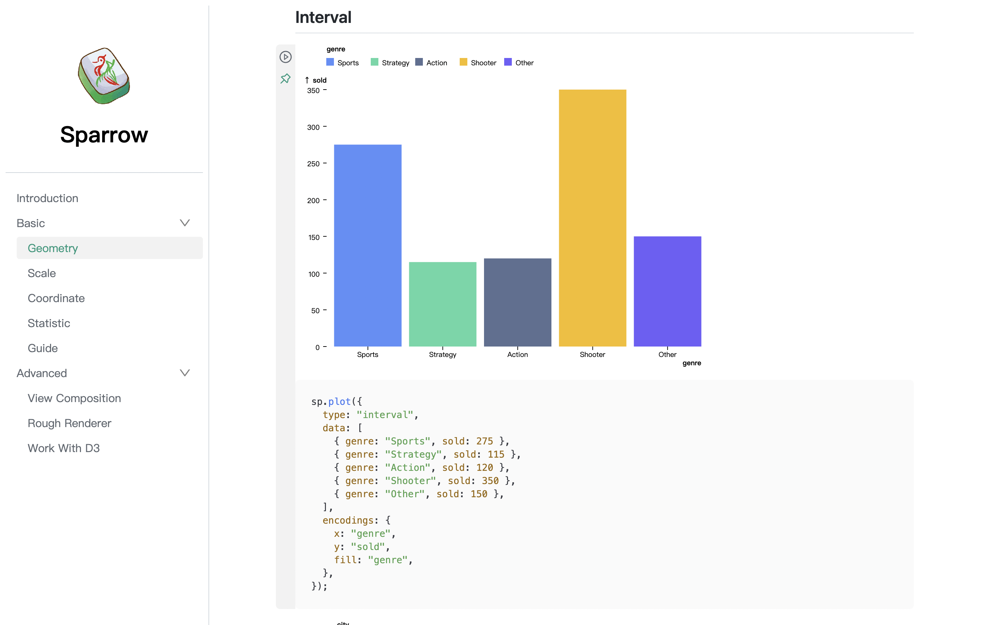
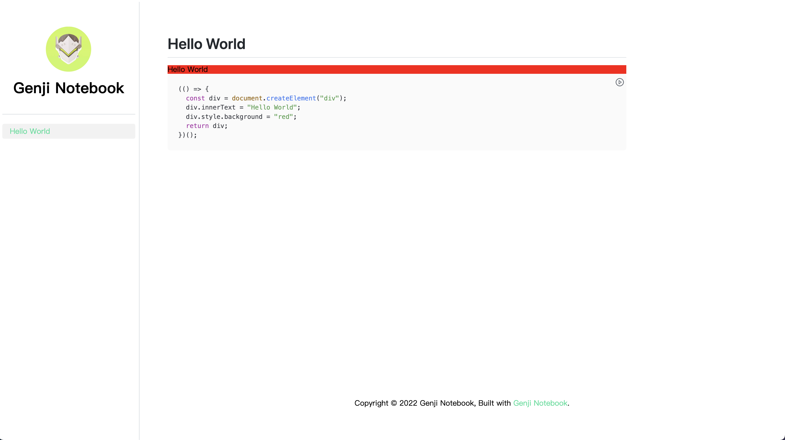

# Genji

A grammar extended from markdown to build observable and interactive JavaScript document. It now has been implemented as a doc tool **genji-notebook** to help your write docs for Canvas/SVG based library.



## Links

- [Showcase](https://sparrow-vis.github.io/#/)
- [Demo](https://pearmini.github.io/genji/)

## Get Started

Install genji-notebook from NPM.

```bash
$ npm i genji-notebook
```

Create a new config file named `.genjirc` in your project root, and specify the `outline` options.

```json
{
  "outline": {
    "Hello World": "hello-world"
  }
}
```

Create a folder named `docs` in your project root and create a markdown file named `hello-world.md` with the following content.

<pre>
# Hello World

```js
(() => {
  const div = document.createElement("div");
  div.innerText = "Hello World";
  div.style.background = "red";
  return div;
})();
```
</pre>

Your project structure is now arranged as below:

```
.
|____docs
| |____hello-world.md
|____.genjirc
```

Then run the following command in your project root for development and open `http://localhost:8000/#/` in your browser.

```bash
$ genji-notebook dev
```

Everything is working as expected if your see the page as blew.



**The red div with "Hello World" in the codeblock of the markdown file is already being rendered into the document!**

You can edit the content of this codeblock directly in the browser if you prefer a yellow div with 100px height. Then click the run button to see what will happen.


Finally run the following command in your project root before you want to deploy your site.

```bash
$ genji-notebook build
```

Futhermore, if you want to deploy the site using [Github Pages](https://pages.github.com/), update the `.genjirc`. (Replace `<account>` with your github account name and replace `<repo>` with your repo name).

```json
{
  "outline": {
    "Hello World": "hello-world"
  },
  "siteGithub": "https://github.com/<account>/<repo>",
  "base": "/<repo>/"
}
```

Then run:

```
$ genji-notebook deploy
```

You can visit `https://<account>.github.io/<repo>/#/` after deploying success.

## API Reference

- [Grammar](#grammar): The grammar extended from markdown.
- [Stdlib](#stdlib): Some tools to help you build your notebook.
- [Options](#options): Options for `.genjirc`.

### Grammar

Every codeblock in JavaScript with markup: `js | dom` or `js` will execute and mounted the return value if it is `HTMLElement` or `SVGElement`.

The valid code in codeblock can be a function returns a `HTMLElement` or `SVGElement`.

<pre>
```js | dom
sp.plot(options) // return a SVGElement
```
</pre>

It also can be an IIFE(immediately-invoked function expression) for complex codeblock.

<pre>
```js | dom
(() => {
  const div = document.createElement("div");
  div.innerText = "Hello World";
  div.style.background = "red";
  return div;
})();
```
</pre>

Async function is also ok.

<pre>
```js | dom
(async () => {
  const text = await new Promise((resolve) =>
    setTimeout(() => resolve("hello"), 3000)
  );
  const div = document.createElement("div");
  div.innerText = "hello";
  div.style.background = "red";
  return div;
})();
```
</pre>

The function can also returns an array: `[DOM, clearCallback]`, the second element of this array will be called before the DOM unmounting.

<pre>
```js | dom
(() => {
  const div = document.createElement("div");
  div.innerText = "1";
  div.style.background = "#28DF99";
  div.style.height = "150px";
  div.style.lineHeight = "150px";
  div.style.fontSize = "100px";
  div.style.color = "white";
  div.style.textAlign = "center";
  const timer = setInterval(() => {
    const number = +div.innerText;
    div.innerText = number + 1;
  }, 1000);
  return [div, () => clearInterval(timer)];
})();
```
</pre>

JavaScript codeblock with `pure` markup will not be execute and acts like a normal text with highlight.

<pre>
```js | pure
(() => {
  const div = document.createElement("div");
  div.innerText = "Hello World";
  div.style.background = "red";
  return div;
})();
```
</pre>

JavaScript codeblock with `pin: false` options will hide the code by default. **The options can be only specified in double quote as following.**

<pre>
```js | dom "pin: false"
(() => {
  const div = document.createElement("div");
  div.innerText = "Hello World";
  div.style.background = "red";
  return div;
})();
```
</pre>

### Stdlib

All the stdlib can be called with namespace **genji** directly in the executable JavaScript codeblock.

<a name="stdlib_preview" href="#stdlib_preview">#</a> **preview**<i>(items, options)</i> · [Examples](https://pearmini.github.io/genji/test4#preview)

Render previews for specified items. Shape of each item is as followed. The `path` must be absolute path from the `config.output` root.

```js
genji.preview(
  [
    {
      thumbnail: "../assets/preview.png",
      path: "/test1/#test-advanced-usage",
      title: "Bar Chart",
    },
    {
      thumbnail: "../assets/preview.png",
      path: "/test1/#test-advanced-usage",
      title: "Bar Chart",
    },
    // ...
  ],
  {
    height: 300, // Default to 200
    size: "contain", // "contain" | "cover", Default to "cover"
  }
);
```

### Options

The options for `.genjirc` are as followed.

| Key                  | Type       | Description                                                                                                                                                                                                                 | Default                                        |
| -------------------- | ---------- | --------------------------------------------------------------------------------------------------------------------------------------------------------------------------------------------------------------------------- | ---------------------------------------------- |
| input                | `string`   | The path to the folder containing all the markdown files.                                                                                                                                                                   | `docs`                                         |
| output               | `string`   | The path to produce the site.                                                                                                                                                                                               | `dist`                                         |
| outline              | `object`   | A nested object to specifies the outline. Every key of the object is the name displayed in the sidebar. It relates a markdown file if the value is the name of the markdown file and it can be a section with object value. | -                                              |
| assets               | `string`   | The path to the assets folder and all the assets used for the site should be in it.                                                                                                                                         | `assets`                                       |
| logo                 | `string`   | The path to the logo of the site.                                                                                                                                                                                           | -                                              |
| github               | `string`   | The github link for the site.                                                                                                                                                                                               | -                                              |
| link                 | `string`   | The custom link for the site.                                                                                                                                                                                               | -                                              |
| notFound.title       | `string`   | The title for missing page.                                                                                                                                                                                                 | `Page Not Found`                               |
| notFound.description | `string`   | The description for the missing page.                                                                                                                                                                                       | `We could not find what you were looking for.` |
| scripts              | `string[]` | A path array to the scripts used in the site.                                                                                                                                                                               | []                                             |
| theme.mainColor      | `string`   | The main color for the site.                                                                                                                                                                                                | `#28DF99`                                      |
| base                 | `string`   | The base path for the site.                                                                                                                                                                                                 | `""`                                           |
| siteGithub           | `string`   | The link to the repo to host the site.(See [gh-pages](https://www.npmjs.com/package/gh-pages) `options.repo`)                                                                                                               | -                                              |
| siteBranch           | `string`   | The name of the branch you'll pushing to. (See [gh-pages](https://www.npmjs.com/package/gh-pages) `options.branch`)                                                                                                         | `gh-pages`                                     |
| domain               | `string`   | The domain of your site. It will create a `CNAME` file if it is specified.                                                                                                                                                  | `undefined`                                    |

See more in [demo](./demo/.genjirc) as example.

## Future Work

- Use rollup to build the output.
- Work as a standalone plugin.
- Allow more markups for codeblock and make it become truly reactive. For example:

<pre>

```js | dom
(() => {
  const div = document.createElement("div");
  div.innerText = number;
  div.style.background = "red";
  return div;
})();
```

```js | number
number = 10
```
</pre>

This snippet will render a div and a slider. Once the slider is been dragged, the text of the div will change correspondingly.

## Thanks

Genji Notebook is inspired the following awesome projects:

- [Observable](https://observablehq.com/)
- [Dumi](https://github.com/umijs/dumi)
- [Docusaurus](https://github.com/facebook/Docusaurus)

## License

MIT
