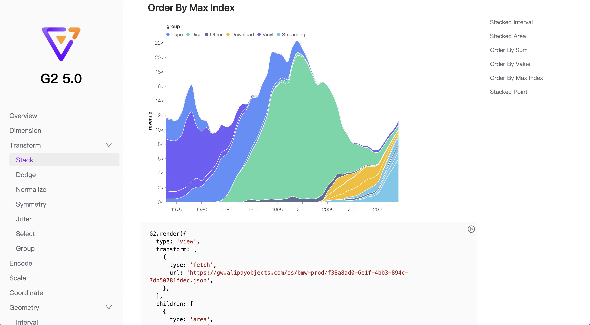
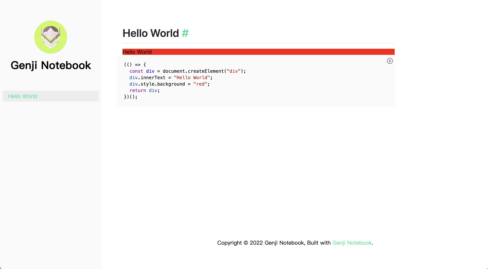

# Genji Notebook

A doc tool based on Genji to build observable and interactive website. It is inspired by [Dumi](https://github.com/umijs/dumi) and [Docusaurus](https://github.com/facebook/Docusaurus).



## Get Started

Install genji-notebook from NPM.

```bash
$ npm i genji-notebook
```

Create a new config file named `.genjirc` in your project root, and specify the `outline` options.

```json
{
  "outline": {
    "Hello World": "hello-world"
  }
}
```

Create a folder named `docs` in your project root and create a markdown file named `hello-world.md` with the following content.

````markdown
# Hello World

```js
(() => {
  const div = document.createElement("div");
  div.innerText = "Hello World";
  div.style.background = "red";
  return div;
})();
```
````

Your project structure is now arranged as below:

```
.
|____docs
| |____hello-world.md
|____.genjirc
```

Then run the following command in your project root for development and open `http://localhost:8000/#/` in your browser.

```bash
$ genji-notebook dev
```

Everything is working as expected if your see the page as blew.



**The red div with "Hello World" in the codeblock of the markdown file is already being rendered into the document!**

Finally run the following command in your project root before you want to deploy your site.

```bash
$ genji-notebook build
```

Futhermore, if you want to deploy the site using [Github Pages](https://pages.github.com/), update the `.genjirc`. (Replace `<account>` with your github account name and replace `<repo>` with your repo name).

```json
{
  "outline": {
    "Hello World": "hello-world"
  },
  "siteGithub": "https://github.com/<account>/<repo>",
  "base": "/<repo>/"
}
```

Then run:

```
$ genji-notebook deploy
```

You can visit `https://<account>.github.io/<repo>/#/` after deploying success.

## Options

The options for `.genjirc` are as followed.

| Key                  | Type       | Description                                                                                                                                                                                                                 | Default                                        |
| -------------------- | ---------- | --------------------------------------------------------------------------------------------------------------------------------------------------------------------------------------------------------------------------- | ---------------------------------------------- |
| input                | `string`   | The path to the folder containing all the markdown files.                                                                                                                                                                   | `docs`                                         |
| output               | `string`   | The path to produce the site.                                                                                                                                                                                               | `dist`                                         |
| outline              | `object`   | A nested object to specifies the outline. Every key of the object is the name displayed in the sidebar. It relates a markdown file if the value is the name of the markdown file and it can be a section with object value. | -                                              |
| assets               | `string`   | The path to the assets folder and all the assets used for the site should be in it.                                                                                                                                         | `assets`                                       |
| logo                 | `string`   | The path to the logo of the site.                                                                                                                                                                                           | -                                              |
| github               | `string`   | The github link for the site.                                                                                                                                                                                               | -                                              |
| link                 | `string`   | The custom link for the site.                                                                                                                                                                                               | -                                              |
| notFound.title       | `string`   | The title for missing page.                                                                                                                                                                                                 | `Page Not Found`                               |
| notFound.description | `string`   | The description for the missing page.                                                                                                                                                                                       | `We could not find what you were looking for.` |
| scripts              | `string[]` | A path array to the scripts used in the site.                                                                                                                                                                               | []                                             |
| theme.mainColor      | `string`   | The main color for the site.                                                                                                                                                                                                | `#28DF99`                                      |
| base                 | `string`   | The base path for the site.                                                                                                                                                                                                 | `""`                                           |
| siteGithub           | `string`   | The link to the repo to host the site.(See [gh-pages](https://www.npmjs.com/package/gh-pages) `options.repo`)                                                                                                               | -                                              |
| siteBranch           | `string`   | The name of the branch you'll pushing to. (See [gh-pages](https://www.npmjs.com/package/gh-pages) `options.branch`)                                                                                                         | `gh-pages`                                     |
| domain               | `string`   | The domain of your site. It will create a `CNAME` file if it is specified.                                                                                                                                                  | `undefined`                                    |

See more in [demo](./demo/.genjirc) as an example.

## License

MIT
