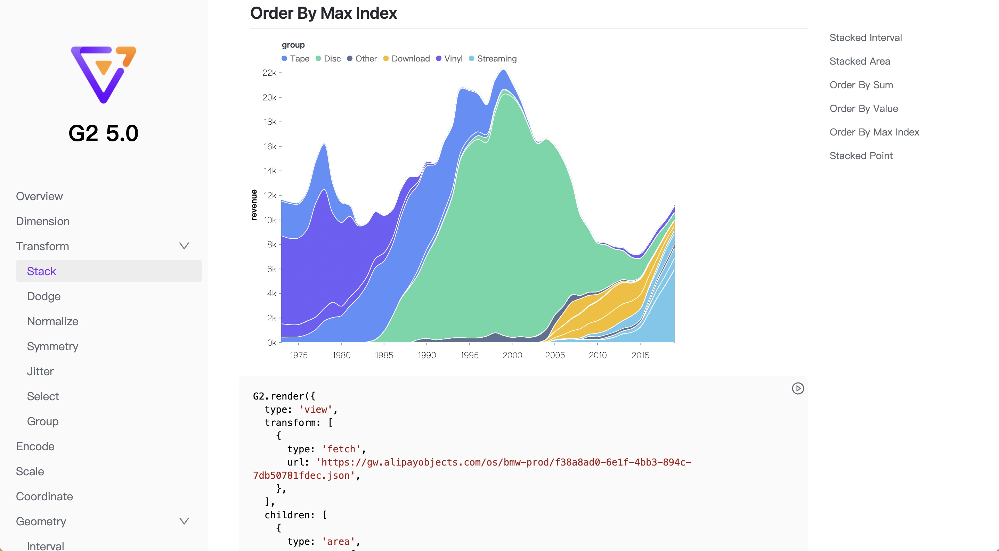
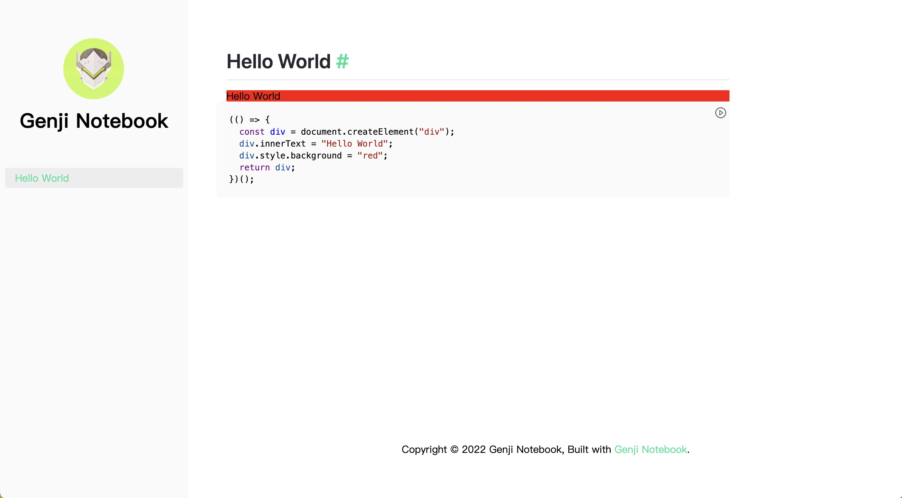
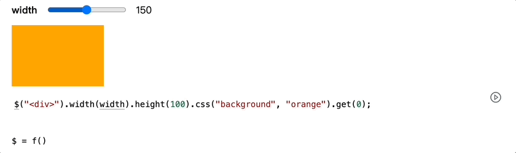

# Genji Notebook

A doc tool based on Genji to build observable and interactive website. It is inspired by [Dumi](https://github.com/umijs/dumi) and [Docusaurus](https://github.com/facebook/Docusaurus).



## Get Started

Install genji-notebook from NPM.

```bash
$ npm i genji-notebook
```

Create a new config file named `.genjirc` in your project root, and specify the `outline` options.

```json
{
  "outline": {
    "Hello World": "hello-world"
  }
}
```

Create a folder named `docs` in your project root and create a markdown file named `hello-world.md` with the following content.

````markdown
# Hello World

```js
(() => {
  const div = document.createElement("div");
  div.innerText = "Hello World";
  div.style.background = "red";
  return div;
})();
```
````

Your project structure is now arranged as below:

```
.
|____docs
| |____hello-world.md
|____.genjirc
```

Then run the following command in your project root for development and open `http://localhost:8000/#/` in your browser.

```bash
$ genji-notebook dev
```

Everything is working as expected if your see the page as blew.



**The red div with "Hello World" in the codeblock of the markdown file is already being rendered into the document!**

Finally run the following command in your project root before you want to deploy your site.

```bash
$ genji-notebook build
```

Futhermore, if you want to deploy the site using [Github Pages](https://pages.github.com/), update the `.genjirc`. (Replace `<account>` with your github account name and replace `<repo>` with your repo name).

```json
{
  "outline": {
    "Hello World": "hello-world"
  },
  "siteGithub": "https://github.com/<account>/<repo>",
  "base": "/<repo>/"
}
```

Then run:

```
$ genji-notebook deploy
```

You can visit `https://<account>.github.io/<repo>/#/` after deploying success.

## Options

The options for `.genjirc` are as followed.

| Key                  | Type       | Description                                                                                                                                                                                                                 | Default                                        |
| -------------------- | ---------- | --------------------------------------------------------------------------------------------------------------------------------------------------------------------------------------------------------------------------- | ---------------------------------------------- |
| input                | `string`   | The path to the folder containing all the markdown files.                                                                                                                                                                   | `docs`                                         |
| output               | `string`   | The path to produce the site.                                                                                                                                                                                               | `dist`                                         |
| outline              | `object`   | A nested object to specifies the outline. Every key of the object is the name displayed in the sidebar. It relates a markdown file if the value is the name of the markdown file and it can be a section with object value. | -                                              |
| assets               | `string`   | The path to the assets folder and all the assets used for the site should be in it.                                                                                                                                         | `assets`                                       |
| logo                 | `string`   | The path to the logo of the site.                                                                                                                                                                                           | -                                              |
| github               | `string`   | The github link for the site.                                                                                                                                                                                               | -                                              |
| link                 | `string`   | The custom link for the site.                                                                                                                                                                                               | -                                              |
| notFound.title       | `string`   | The title for missing page.                                                                                                                                                                                                 | `Page Not Found`                               |
| notFound.description | `string`   | The description for the missing page.                                                                                                                                                                                       | `We could not find what you were looking for.` |
| scripts              | `string[]` | A path array to the scripts used in the site.                                                                                                                                                                               | []                                             |
| theme.mainColor      | `string`   | The main color for the site.                                                                                                                                                                                                | `#28DF99`                                      |
| base                 | `string`   | The base path for the site.                                                                                                                                                                                                 | `""`                                           |
| siteGithub           | `string`   | The link to the repo to host the site.(See [gh-pages](https://www.npmjs.com/package/gh-pages) `options.repo`)                                                                                                               | -                                              |
| siteBranch           | `string`   | The name of the branch you'll pushing to. (See [gh-pages](https://www.npmjs.com/package/gh-pages) `options.branch`)                                                                                                         | `gh-pages`                                     |
| domain               | `string`   | The domain of your site. It will create a `CNAME` file if it is specified.                                                                                                                                                  | `undefined`                                    |

See more in [demo](./demo/.genjirc) as an example.

## Simple Example

Let's get started with a simple but solid example.

````markdown
```js | range "pin: false; min: 100; max: 200"
width = 150;
```

```js
$("<div></div>").width(width).height(100).css("background", "orange").get(0);
```

```js | dom "pin: false"
$ = genji.require("jquery");
```
````

The markdown above will be rendered as follows in Genji environment.



This example dose three things:

- Require [Jquery](https://jquery.com/) by the function `genji.require` from **builtin library** asynchronously.
- Declare a **reactive variable** `width` and mark it as a range output using markup _range_.
- Using required Jquery and `width` variable to render a **responsive orange div element**.

Let's explain how Genji manage to do these.

Each JavaScript codeblock in Genji is **executable** and **editable** by default. And it supposed to have only one _statement_ or _expression_ in each codeblock. The return value of the codeblock will be displayed in the document as output with different form.

If it is a _HTMLElement_ or _SVGElement_, the element will be mounted directly, such as:

```js
$("<div></div>").width(width).height(100).css("background", "orange").get(0);
```

If it is a non-element value, the _description_ of the value will be displayed by default, such as:

```js
$ = genji.require("jquery");
```

It is also possible to change the default display of non-element value by **markup**, such as:

```js | range "pin: false; min: 100; max: 200"
width = 150;
```

The return value is number by default, but with markup `range`, it will be rendered as range input with specified options `pin: false; min: 100; max: 200`. Besides inputs markup, there are also other kind of markup types such as _table_, which will render an array of object into a table.

Each codeblock is not independent and can reference each other. **It can be synchronous or asynchronous, and once its value has changed, the output of codeblocks reference it will rerender.** This is why every time the input value of the range input changed, the orange div element will change simultaneously.

There is no need for you to consider the order of codeblocks in the document, Genji is smart enough to execute the codeblocks in right order.

## Specification

- [Codeblock](#Codeblock) - The supported codeblock syntax.
- [Markup](#Markup) - Markup to decorate the return value of codeblock.
- [Stdlib](#Stdlib) - Some builtin functions to help write codeblock.

### Codeblock

<a name="declare_a_variable" href="#declare_a_variable">#</a> **Declare a variable.**

The following ways of declaring a variable have no difference, but the first one is recommended, because it makes more sense as each variable is changeable.

````markdown
```js
a = 1;
```

```js
let a = 1;
```

```js
var a = 1;
```

```js
const a = 1;
```
````

<a name="declare_a_function" href="#declare_a_function">#</a> **Declare a function.**

````markdown
```js
// Declare a synchronous function.
function add(x, y) {
  return x + y;
}
```

```js
// Declare a asynchronous function.
async function delay(ms) {
  await new Promise((resolve) => setTimeout(ms, resolve));
}
```
````

<a name="call_a_function" href="#call_a_function">#</a> **Call a function**

````markdown
```js
// Call a defined function
add(1, 1);
```

```js
// Call a synchronous IIFE(immediately-invoked function expression)
// This is useful for complex codeblock.
(() => {
  const div = document.createElement("div");
  div.innerText = "Hello World";
  div.style.background = "red";
  return div;
})();
```

```js
// Call a asynchronous IIFE.
(async () => {
  const text = await new Promise((resolve) =>
    setTimeout(() => resolve("hello"), 3000)
  );
  const div = document.createElement("div");
  div.innerText = "hello";
  div.style.background = "red";
  return div;
})();
```
````

<a name="execute_an_expression" href="#execute_an_expression">#</a> **Execute an expression**

```js
height = width * 2;
```

### Markup

Markup is specified as `js | [markup] "[options]"`, where options follow the format `"key1: value1; key2: value2;..."`. **The options can be only specified in double quote and all is optional**.

<a name="markup_pure" href="#markup_pure">#</a> **pure**

JavaScript codeblock with _pure_ markup will not execute and acts like a normal text with highlight.

````markdown
```js | pure
(() => {
  const div = document.createElement("div");
  div.innerText = "hello world";
  div.style.background = "red";
  return div;
})();
```
````

<a name="markup_dom" href="#markup_dom">#</a> **dom**

The default markup for all executable codeblock is _dom_, it can be ignored if there is no options for this markup.

```ts
type Options = {
  /**
   * @description Hide the code by default with false value.
   * @default false
   */
  pin?: boolean;
};
```

````markdown
```js | dom
(() => {
  const div = document.createElement("div");
  div.innerText = "hello world";
  div.style.background = "red";
  return div;
})();
```
````

<a name="markup_text" href="#markup_text">#</a> **text**

Render `<input type='text'>`.

```ts
type Options = {
  /**
   * @description The label for the input.
   */
  label?: string;
  /**
   * @description Hide the code by default with false value.
   * @default false
   */
  pin?: boolean;
};
```

````markdown
```js | text
a = "hello world";
```
````

<a name="markup_number" href="#markup_number">#</a> **number**

Render `<input type='number'>`.

```ts
type Options = {
  /**
   * @description The label for the input.
   */
  label?: string;
  /**
   * @description The step of the input.
   * @default 1
   */
  step?: number;
  /**
   * @description The min value of the input.
   * @default -Infinity
   */
  min?: number;
  /**
   * @description The max value of the input.
   * @default Infinity
   */
  max?: number;
  /**
   * @description Hide the code by default with false value.
   * @default false
   */
  pin?: boolean;
};
```

````markdown
```js | number "min:1; max: 20; step: 2"
a = 10;
```
````

<a name="markup_range" href="#markup_range">#</a> **range**

Render `<input type='range'>`.

```ts
type Options = {
  /**
   * @description The label for the input.
   */
  label?: string;
  /**
   * @description The step of the input.
   * @default 1
   */
  step?: number;
  /**
   * @description The min value of the input.
   * @default -Infinity
   */
  min?: number;
  /**
   * @description The max value of the input.
   * @default infinity
   */
  max?: number;
  /**
   * @description Hide the code by default with false value.
   * @default false
   */
  pin?: boolean;
};
```

````markdown
```js | range "min:1; max: 20; step: 2"
a = 10;
```
````

<a name="markup_color" href="#markup_color">#</a> **color**

Render `<input type='color'>`.

```ts
type Options = {
  /**
   * @description The label for the input.
   */
  label?: string;
  /**
   * @description Hide the code by default with false value.
   * @default false
   */
  pin?: boolean;
};
```

````markdown
```js | color
a = "red";
```
````

<a name="markup_select" href="#markup_select">#</a> **select**

Render a `<select>`.

```ts
type Options = {
  /**
   * @description The label for the input.
   */
  label: string;
  /**
   * @description The options for select.
   * @default []
   */
  options: { labels: string[]; values: (string | number)[] }[];
  /**
   * @description Hide the code by default with false value.
   * @default false
   */
  pin?: boolean;
};
```

````markdown
```js | select "options: { labels: ['A', 'B', 'C'], values: ['a', 'b', 'c'] }"
a = "a";
```
````

<a name="markup_radio" href="#markup_radio">#</a> **radio**

Render a `<radio>`.

```ts
type Options = {
  /**
   * @description The label for the input.
   */
  label: string;
  /**
   * @description The options for radio.
   * @default []
   */
  options: { labels: string[]; values: (string | number)[] }[];
  /**
   * @description Hide the code by default with false value.
   * @default false
   */
  pin?: boolean;
};
```

````markdown
```js | radio "options: { labels: ['A', 'B', 'C'], values: ['a', 'b', 'c'] }"
a = "a";
```
````

<a name="markup_table" href="#markup_table">#</a> **table**

Render an array of objects into a table.

```ts
type Options = {
  /**
   * @description The max count of rows.
   * @default 10
   */
  maxCount: number;
  /**
   * @description Hide the code by default with false value.
   * @default false
   */
  pin?: boolean;
};
```

````markdown
```js | table "maxCount: 5"
data = [
  { year: "1951 年", sale: 38 },
  { year: "1952 年", sale: 52 },
  { year: "1956 年", sale: 61 },
  { year: "1957 年", sale: 145 },
  { year: "1958 年", sale: 48 },
  { year: "1959 年", sale: 38 },
  { year: "1960 年", sale: 38 },
  { year: "1962 年", sale: 38 },
];
```
````

### Stdlib

All the stdlib can be called with namespace **genji** directly in the executable JavaScript codeblock.

<a name="stdlib_preview" href="#stdlib_preview">#</a> **preview**<i>(items, options)</i> · [Examples](https://pearmini.github.io/genji/test4#preview)

Render previews for specified items. Shape of each item is as followed.

```ts
type Item = {
  /**
   * @description The image for the thumbnail.
   */
  thumbnail: string;
  /**
   * @description The path to the codeblock for the thumbnail.
   * @note It must be absolute path from the `config.output` root.
   */
  path: string;
  /**
   * @description The title for the thumbnail.
   */
  title: string;
};

type Options = {
  /**
   * @description The height for each thumbnail.
   * @default 175
   */
  height: number;
  /**
   * @description The css background-size
   * @default cover
   */
  size: "contain" | "cover";
};
```

```js
genji.preview(
  [
    {
      thumbnail: "../assets/preview.png",
      path: "/test1/#test-advanced-usage",
      title: "Bar Chart",
    },
    {
      thumbnail: "../assets/preview.png",
      path: "/test1/#test-advanced-usage",
      title: "Bar Chart",
    },
  ],
  {
    height: 300,
    size: "contain",
  }
);
```

<a name="stdlib_fetchJSON" href="#stdlib_fetchJSON">#</a> **fetchJSON**<i>(url)</i>

Fetch file with JSON format and return an object.

```js
const data = await fetchJSON(
  "https://gw.alipayobjects.com/os/antvdemo/assets/data/bubble.json"
);
```

<a name="stdlib_require" href="#stdlib_require">#</a> **require**<i>(url)</i>

See [d3-require](https://github.com/d3/d3-require) for more details.

## License

MIT
